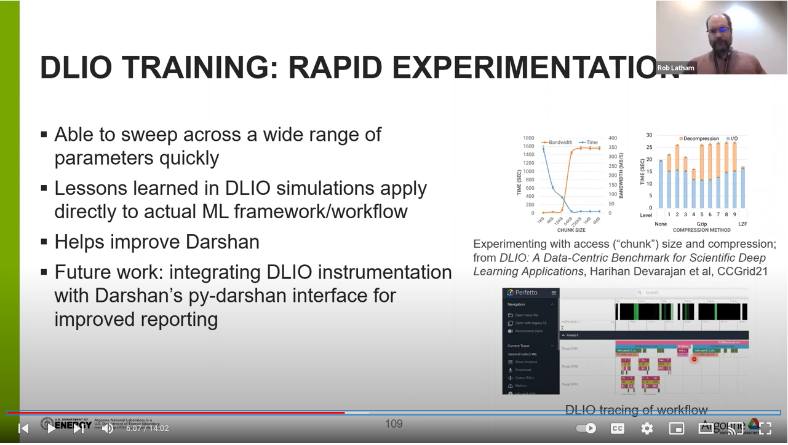

# A look at machine learning

The AI and machine learning workloads look different than the simulation and
visualisation I/O workloads of the past.   I'm excited about the
[DLIO](https://github.com/argonne-lcf/dlio_benchmark) benchmark and how it will
let I/O researchers like me try out different machine learning engines without
having to set up entire machine learning environments.

When I gave this presentation I struggled to collect information with Darshan.
I intend to update this section once we have figured out the problem.

