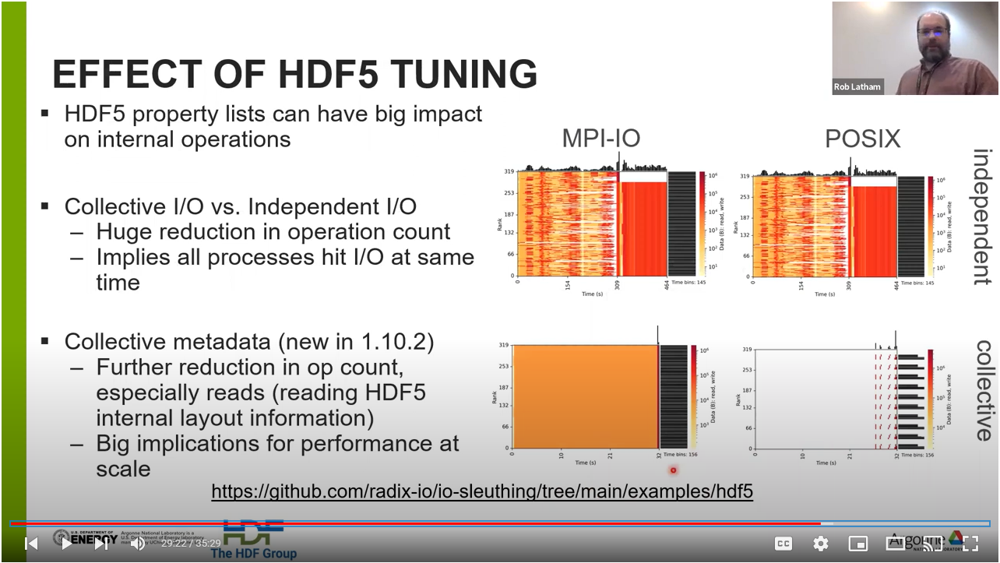

# A look at HDF5 optimizations

High-level I/O libraries, like HDF5, take MPI-IO's features (and
complexity) and package them under an interface that should feel more natural
to computational scientists.  Scientific applications operate at a higher level
of abstraction typically think about arrays or matrices, not "bytes on disk".

[HDF5](https://www.hdfgroup.org/solutions/hdf5/) provides the array-oriented
data model and portable file formats that scientific applications from many
domains find helpful.  Tuning HDF5 requires turning on several important
features for highest performance.

## Running the experiment

Instead of using IOR, I've written a small test program (`h5par-comparison.c`
where each process writes one variable to an HDF5 dataset in parallel.
Those processes are each writing their own column of an array.

We will compare three approaches:
- "default":  HDF5 without any tuning.
- "collective data":  ask HDF5 to write the data using MPI-IO collective routines
- "collective metadata":  ask HDF5 to update the internal bookkeeping collectively

Some details are machine-specific.  The `polaris/hdf5-compare.sh`
script is what I submitted to the Polaris job scheduler.

## generating plots

Instead of generating plots of the benchmark's numbers, we are going to use
[Darshan](https://www.mcs.anl.gov/research/projects/darshan/) .

## Video

