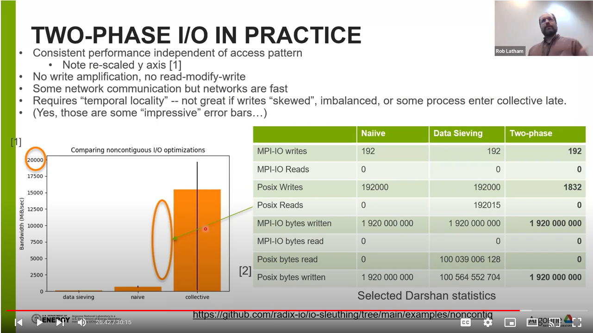

# Study impact of access pattern on file I/O performance

A parallel file system likes to operate on regular sizes of I/O (typically a
few megabytes, typically a power of two).  Scientific applications operate at a
higher level of abstraction and might not think about "bytes on disk" at all.
Particle tracking and reading subarrays, for just two examples, can generate
"non-contiguous" accesses that aren't well suited to a parallel file system.

## Running the experiment

Again we'll use the [IOR benchmark](https://github.com/hpc/ior).  We need a
fairly recent version (the 4.0 release candidate or newer) that correctly
constructs MPI datatypes.  We'll ask IOR to construct an MPI datatype where
each process writes 1000 small sections of a file.

We can look at several configurations:
- "naiive" -- disable all optimizations
- "data sieving" -- ROMIO's "read-modify-write" optimization: sometimes a win,
  often because of the additional data read and need to serialize updates to
  the file will end up hurting performance
- "collective buffering" -- if collective I/O an option, two phase collective
  buffering can hugely benefit nonconiguous accesses.
- Additional optimizations:  Cray's modifications to MPICH include "lockahead"
  which should help performance in all cases. Still investigating the best way
  to use this optimization.

Some details are machine-specific.  The `polaris/ior-noncontig-collective.sh`
script is what I submitted to the Polaris job scheduler.

## generating plots

Each time IOR finishes, it outputs some statistics about performance.  The
`get-results.sh` script will pull that data out into a format we can plot.

`noncontig-plot.py` is a python Matplotlib script to generate the bar chart
plots used in the presentation

## Video

