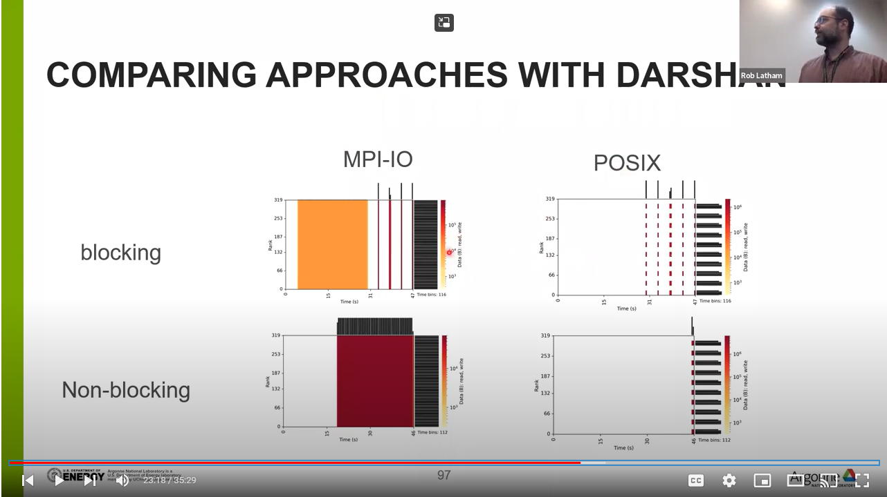

# A look at Parallel-NetCDF features

High-level I/O libraries, like Parallel-NetCDF, take MPI-IO's features (and
complexity) and package them under an interface that should feel more natural
to computational scientists.  Scientific applications operate at a higher level
of abstraction typically think about arrays or matricies, not "bytes on disk".

[Parallel-NetCDF](https://github.com/Parallel-NetCDF/PnetCDF) sees a lot of use
in the climate and weather communities.  It has a fairly simple data model and
programming interface.  That simplicity has made it possible for us to
experiment with classes of interfaces.  One approach that has worked well for
us over the years is "operation combining" -- using the non-blocking interface
to in a sense pre-declare I/O operations.  PnetCDF will, once the application
"waits" for all I/O to finish, bundle up all operations into a single more
efficient operation.

## Running the experiment

Instead of using IOR, I've written a small test program (`pnetcdf-write.c`),
where each process writes five variables to a netCDF dataset in parallel.
Those processes are each writing their own column of an array.

We will compare two approaches:
- "Blocking": the program will collectively write each variable one at a time.
- "non-blocking": the program will use the PnetCDF non-blocking interfaces to
  post the five writes, then wait for them to complete.

Some details are machine-specific.  The `polaris/pnetcdf-write-compare.sh`
script is what I submitted to the Polaris job scheduler.

## generating plots

Instead of generating plots of the benchmark's numbers, we are going to use
[Darshan](https://www.mcs.anl.gov/research/projects/darshan/) .

## Video

