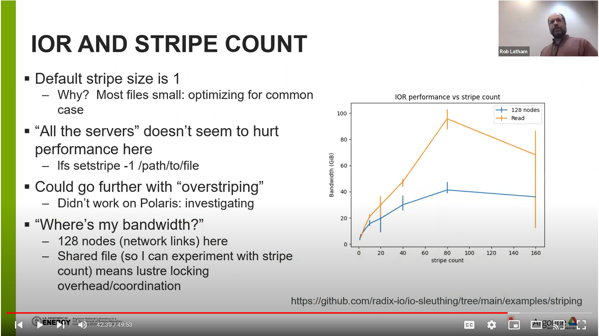

# Study impact of stripe count on file I/O performance

A parallel file system is parallel in two ways:
   1. it works efficiently with many simultaneous clients
   2. it collects multiple storage devices into a single unified namespace

How many "storage devices" is the right number?  Too few and you won't see good
performance.  Too many and you might incur overhead as the file system
communicates with more devices than it needs to.

Lustre typically has a small default stripe count, which works well for common
"home directory" workloads.  In this experiment we'll show how the stripe count
alters performance.

## Running the experiment

Th [IOR benchmark](https://github.com/hpc/ior) runs everywhere (and if it
doesn't that's a bug).  For this experiment I am using the MPI-IO interface and
adjusting the `striping_factor` hint.

Some details are machine-specific.  The `polaris/ior-stripes.sh` script is what I submitted to the Polaris job scheduler.

## generating plots

Each time IOR finishes, it outputs some statistics about performance.  The `get-stripe-dat.sh` script will pull that data out into a format we can plot.

`stripe-plot.py` is a python Matplotlib script to generate the plots.

## Video

